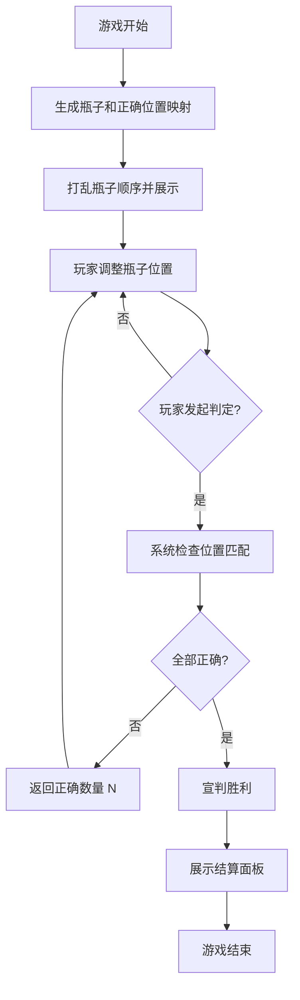

# 摆瓶子游戏 —— 游戏设计文档

---

## 1. 游戏概述

### 1.1 游戏简介

《摆瓶子游戏》（RightPlace）是一款基于位置推理的休闲益智游戏。每一轮游戏中，桌面上会出现一组不同模型的瓶子，瓶子的初始顺序被打乱，玩家需要凭借记忆和逻辑推理，将每一个瓶子摆放到其正确的位置上，并通过系统的判定反馈逐步逼近正确答案，最终完成排列。

### 1.2 核心玩法

- 玩家将桌面上的瓶子拖拽到不同的位置槽位中
- 每次摆放后，玩家可以发起一次「判定」操作
- 系统告知玩家当前摆放结果中 **摆放正确的瓶子数量**
- 玩家根据判定反馈调整瓶子位置，重复判定，直至全部正确

---

## 2. 游戏规则

### 2.1 瓶子与位置

- **瓶子模型唯一性**：每场游戏中出现的所有瓶子模型各不相同，不存在两个外观完全相同的瓶子。
- **位置槽位数量**：位置槽位的数量与瓶子数量相等，一一对应。
- **正确位置**：每个瓶子在游戏开始时被分配一个唯一的正确位置，该正确位置在游戏过程中不会改变。
- **初始状态**：游戏开始时，瓶子被随机打乱放置在位置槽位上，或放置在待摆放区域供玩家操作。

### 2.2 判定规则

- 玩家在每轮游戏中至少拥有 **一次判定机会**。
- 判定次数不设上限，玩家在任意时刻均可发起判定。
- 每次判定时，系统会计算当前所有瓶子的摆放位置与正确位置的匹配情况，并反馈一个数字：**已摆放正确的瓶子数量**。
- 系统 **不会** 告知玩家具体哪个瓶子位置正确或哪个位置错误 —— 玩家需要根据数字自行推理。
- 当玩家将 **所有瓶子均摆放到正确位置** 并发起判定时，系统宣判胜利，不再仅返回数字，而是直接告知玩家所有瓶子均已摆放正确。

### 2.3 胜利条件

- 玩家发起一次判定，且所有瓶子的当前位置均等于其正确位置。
- 系统宣判胜利后，游戏结束。

---

## 3. 游戏流程



### 3.1 流程详解

1. **初始化阶段**：游戏生成本轮的瓶子集合，并为每个瓶子分配一个唯一正确的位置索引，然后随机打乱瓶子展示给玩家。
2. **游玩阶段**：玩家自由操作瓶子，将其拖拽到各个位置槽位。此阶段 **开始计时**。
3. **判定阶段**：玩家点击"判定"按钮，系统计算正确瓶子数量并反馈。
4. **胜利阶段**：当所有瓶子位置正确时系统宣判胜利，**停止计时**，进入结算。

---

## 4. 计分与统计

### 4.1 游戏记录项

游戏结束后，结算面板展示以下三项数据：

| 数据项 | 说明 | 计算方式 |
|--------|------|----------|
| **游玩时间** | 玩家从开始摆放到宣判胜利的总用时 | 从玩家第一次操作或进入游玩阶段开始计时，到宣判胜利时结束计时。进入游戏界面但未开始操作不计时。 |
| **游戏轮次** | 本场游戏的总轮次数 | 每重新开始一局新排列计为 1 轮。若是单局模式则固定为 1。 |
| **判定次数** | 玩家在本场游戏中发起判定的总次数 | 每点击一次"判定"按钮并收到系统反馈计为 1 次。 |

### 4.2 游玩时间计时规则

- **计时起点**：玩家首次与瓶子进行交互操作（如拖拽、点击互换、或点击开始摆放按钮）时开始计时。
- **计时终点**：系统宣判胜利时停止计时。
- **计时精度**：精确到秒（或毫秒，视实现而定），显示格式为 `MM:SS` 或 `HH:MM:SS`。

---

## 5. 玩家交互

### 5.1 操作方式

玩家可通过以下方式操作瓶子：

- **拖拽交换**：将一个瓶子拖拽到另一个瓶子的位置，两者位置互换。
- **点击交换**：依次点击两个瓶子，使其位置互换。
- **拖拽到空位**：将瓶子拖拽到空位槽中。

### 5.2 界面元素

| 界面元素 | 功能描述 |
|----------|----------|
| **瓶子展示区** | 展示所有瓶子的当前位置，所有瓶子按槽位排列。 |
| **判定按钮** | 点击后系统检查当前排列并反馈正确数量。 |
| **判定反馈区** | 显示本次判定结果（正确数量或胜利宣判）。 |
| **历史判定记录** | 可选的辅助信息，显示每次判定的结果历史。 |
| **计时器** | 实时显示当前游戏已用时，仅在游玩阶段可见并更新。 |
| **重新开始按钮** | 重置本局游戏，重新打乱瓶子。 |
| **结算面板** | 游戏结束时弹出，展示游玩时间、游戏轮次、判定次数。 |

---

## 6. 难度设计建议

### 6.1 瓶子数量分级

| 难度级别 | 瓶子数量 | 适合人群 |
|----------|----------|----------|
| 简单 | 3 ~ 4 个 | 新手入门 |
| 普通 | 5 ~ 6 个 | 一般玩家 |
| 困难 | 7 ~ 8 个 | 进阶玩家 |
| 专家 | 9 ~ 10 个 | 硬核玩家 |
| 地狱 | 11 ~ 12 个 | 终极挑战 |

### 6.2 扩展机制（可选）

- **步数限制**：限制玩家的判定次数或操作步数，增加策略深度。
- **时间挑战**：设定时间倒计时，在限定时间内完成。

---

## 7. 关卡模式（v1.1 新增）

### 7.1 模式概述

关卡模式是游戏的核心扩展玩法，提供 **30 个循序渐进关卡** 的挑战体系。玩家通过逐关挑战，逐步熟悉瓶子的摆放推理逻辑，并在中后期面对多种瓶子数量的混合挑战。

### 7.2 关卡结构

#### 总体难度曲线

关卡难度呈 **整体递增、局部波动** 的曲线：

```
瓶子数
 12 │              ▂   ▃     █   ▃
 11 │           ▂  █ █ █   █ █ █ █
 10 │         █ █ █ █ █ █ █ █ █ █ █
  9 │         █ █ █ █ █ █ █ █ █ █ █
  8 │       █ █ █ █ █ █ █ █ █ █ █ █
  7 │     ▃ █ █ █ █ █ █ █ █ █ █ █ █
  6 │   █ █ █ █ █ █ █ █ █ █ █ █ █ █
  5 │ ▃ █ █ █ █ █ █ █ █ █ █ █ █ █ █
  4 │ █ █ █ █ █ █ █ █ █ █ █ █ █ █ █
  3 │ █ █ █ █ █ █ █ █ █ █ █ █ █ █ █
   └──────────────────────────────────▶ 关卡
     1 2 3 4 5 6 7 8 9 ...      ... 30
```

#### 关卡分段

| 阶段 | 关卡范围 | 瓶子数量范围 | 说明 |
|------|----------|-------------|------|
| 新手期 | 第 1 ~ 6 关 | 3 ~ 4 个 | 仅 3~4 个瓶子，让玩家熟悉核心玩法 |
| 过渡期 | 第 7 ~ 10 关 | 4 ~ 6 个 | 瓶子数量逐渐增多，难度温和提升 |
| 进阶期 | 第 11 ~ 18 关 | 5 ~ 8 个 | 混合 5~8 个瓶子，同一数量会连续出现多关 |
| 高手期 | 第 19 ~ 25 关 | 7 ~ 10 个 | 开始出现 9~10 个瓶子，但也会穿插 7~8 个瓶子的关卡 |
| 巅峰期 | 第 26 ~ 30 关 | 8 ~ 12 个 | 8~12 个瓶子随机分配，不再单调递增 |

> **核心设计原则**：中后期关卡（8~12 个瓶子）的瓶子数量 **不按关卡严格递增**，而是交叉混合出现。例如可能出现第 20 关（10 个瓶子）→ 第 21 关（8 个瓶子）→ 第 22 关（11 个瓶子），让玩家无法单纯依赖"这一关比上一关多一个瓶子"的惯性思维，从而保持推理的挑战性。

#### 30 关卡瓶子数量分布示例

| 关卡 | 瓶子数 | 关卡 | 瓶子数 | 关卡 | 瓶子数 |
|------|--------|------|--------|------|--------|
| 第 1 关 | 3 | 第 11 关 | 6 | 第 21 关 | 9 |
| 第 2 关 | 3 | 第 12 关 | 7 | 第 22 关 | 8 |
| 第 3 关 | 4 | 第 13 关 | 5 | 第 23 关 | 10 |
| 第 4 关 | 3 | 第 14 关 | 7 | 第 24 关 | 11 |
| 第 5 关 | 4 | 第 15 关 | 8 | 第 25 关 | 9 |
| 第 6 关 | 4 | 第 16 关 | 6 | 第 26 关 | 12 |
| 第 7 关 | 5 | 第 17 关 | 8 | 第 27 关 | 10 |
| 第 8 关 | 4 | 第 18 关 | 7 | 第 28 关 | 11 |
| 第 9 关 | 5 | 第 19 关 | 9 | 第 29 关 | 12 |
| 第 10 关 | 6 | 第 20 关 | 8 | 第 30 关 | 12 |

### 7.3 关卡配置

每个关卡独立配置以下参数：

| 参数 | 说明 | 示例 |
|------|------|------|
| **关卡 ID** | 全局唯一标识 | `level_01` |
| **关卡序号** | 1~30 的连续编号 | 1 |
| **瓶子数量** | 本关使用多少个瓶子 | 3 ~ 12 |
| **瓶子模型池** | 从哪个主题模型池中选取瓶子 | 经典调酒 / 实验室 / 魔法药水 / 远古遗迹 |
| **判定次数限制** | 可选，限制本关最多判定次数 | 不限 / 10 次 / 5 次 |
| **时间限制** | 可选，限制本关最长用时 | 不限 / 120s / 60s |
| **星级评价阈值** | 三星/二星/一星的达成条件 | 见 7.5 |
| **前置关卡** | 解锁本关需要通关的关卡 | `level_01` |

### 7.4 过关条件

- **基础过关条件**：在判定次数和/或时间限制内将所有瓶子摆放至正确位置。
- 若有关卡附加了判定次数限制或时间限制，超出限制则判定为失败，玩家可重试当前关卡。

### 7.5 星级评价

每关根据玩家的表现评定一至三星，鼓励玩家追求更高水准：

| 星级 | 评价标准 | 奖励 |
|------|----------|------|
| ★★★ | 判定次数 ≤ 最佳阈值（如瓶子数 × 2） | 满星奖励，解锁隐藏内容 |
| ★★ | 判定次数 ≤ 宽松阈值（如瓶子数 × 3） | 正常通关奖励 |
| ★ | 在限制内完成摆放 | 通关解锁下一关 |

- **无限制关卡**：仅依据判定次数评定星级。
- **限制关卡**：在限制内完成即为三星，失败可重试。

### 7.6 视觉主题

游戏提供多套视觉主题，主题不绑定关卡进度，而是作为视觉点缀交错出现，避免审美疲劳：

| 主题 | 瓶子风格 | 出现范围 |
|------|----------|----------|
| 经典调酒 | 经典调酒瓶款式（马提尼瓶、威士忌瓶、红酒瓶等） | 随机分配于各关卡 |
| 科学实验室 | 实验室器皿风格（烧瓶、量筒、试管瓶等） | 随机分配于各关卡 |
| 魔法药水 | 魔法药水瓶风格（水晶瓶、骷髅瓶、星月瓶等） | 随机分配于各关卡 |
| 远古遗迹 | 远古文物风格（陶罐、青铜瓶、符文瓶、宝石瓶等） | 随机分配于各关卡 |

> 主题仅影响视觉表现，不影响关卡难度。同一关卡内所有瓶子使用同一套主题风格，提升视觉一致性。

### 7.7 关卡选择界面

#### 界面布局

```
┌───────────────────────────────────────────┐
│  ← 返回主菜单         关卡选择    总 ⭐ 45/90 │
├───────────────────────────────────────────┤
│                                            │
│  ┌────┐ ┌────┐ ┌────┐ ┌────┐ ┌────┐      │
│  │ L1★│ │ L2★│ │ L3★│ │ L4★│ │ L5★│      │
│  │ 3瓶 │ │ 3瓶 │ │ 4瓶 │ │ 3瓶 │ │ 4瓶 │      │
│  └────┘ └────┘ └────┘ └────┘ └────┘      │
│  ┌────┐ ┌────┐ ┌────┐ ┌────┐ ┌────┐      │
│  │ L6★│ │ L7★│ │ L8 │ │L9🔒│ │L10🔒│      │
│  │ 4瓶 │ │ 5瓶 │ │ 4瓶 │ │ 5瓶 │ │ 6瓶 │      │
│  └────┘ └────┘ └────┘ └────┘ └────┘      │
│  ┌────┐ ┌────┐ ┌────┐ ┌────┐ ┌────┐      │
│  │L11🔒│ │L12🔒│ │L13🔒│ │... │ │... │      │
│  │ 6瓶 │ │ 7瓶 │ │ 5瓶 │ │    │ │    │      │
│  └────┘ └────┘ └────┘ └────┘ └────┘      │
│              ...（向下滚动）...              │
│  ┌────┐ ┌────┐ ┌────┐ ┌────┐ ┌────┐      │
│  │L26🔒│ │L27🔒│ │L28🔒│ │L29🔒│ │L30🔒│      │
│  │12瓶 │ │10瓶 │ │11瓶 │ │12瓶 │ │12瓶 │      │
│  └────┘ └────┘ └────┘ └────┘ └────┘      │
└───────────────────────────────────────────┘
```

- 30 个关卡以 **网格布局** 展示，按顺序从左到右、从上到下排列。
- 已通关关卡显示获得的星级（★/★★/★★★）；当前可挑战关卡高亮边框；未解锁关卡显示锁图标。
- 每张关卡卡片下方标注本关的 **瓶子数量**，方便玩家了解难度。
- 顶部显示玩家 **累计总星数**（如 45/90）。

### 7.8 关卡结算

每关结束后弹出的结算面板比基础结算增加以下信息：

| 数据项 | 说明 |
|--------|------|
| **本次星级** | 本关获得的星级评价（1~3 ★） |
| **游玩时间** | 本关用时 |
| **判定次数** | 本关发起判定的次数 |
| **关卡总星数** | 当前关卡历史最佳星级 |
| **下一关按钮** | 通关后自动解锁并跳转至下一关 |
| **重试按钮** | 不满意表现可重试当前关 |

### 7.9 数据持久化

关卡模式需要持久化存储以下玩家进度数据：

```
LevelSaveData {
  levelStars: Map<int, int>,      // 关卡序号(1-30) → 最佳星级 (0-3)
  levelBestRecords: Map<int, {    // 关卡序号 → 最佳记录
    bestTime: number,              // 最佳用时（秒）
    bestJudges: number,            // 最少判定次数
    completedAt: timestamp,        // 首次完成时间
  }>,
  totalStars: number,             // 累计总星数
}
```

## 8. 技术实现建议

### 8.1 核心数据结构

```
// 瓶子对象
Bottle {
  id: string,            // 唯一标识符
  name: string,          // 瓶子名称/标签
  model: string/asset,   // 瓶子模型资源
  correctPosition: int   // 正确位置的索引（生成时确定）
}

// 游戏状态
GameState {
  bottles: Bottle[],     // 瓶子列表
  slots: number,         // 位置槽位数（= bottles.length）
  currentPositions: int[], // 当前每个位置的瓶子 id 映射
  correctPositions: Map, // 瓶子 id → 正确位置
  isStarted: boolean,    // 游戏是否已开始摆放
  isFinished: boolean,   // 游戏是否已结束
  startTime: timestamp,  // 计时开始时间
  endTime: timestamp,    // 计时结束时间
  judgeCount: number,    // 判定次数
}
```

### 8.2 判定逻辑伪代码

```
function judge(currentPositions, correctPositions):
    correctCount = 0
    for each bottle in bottles:
        if currentPositions[bottle.id] == correctPositions[bottle.id]:
            correctCount++
    
    if correctCount == totalBottles:
        return WIN
    else:
        return correctCount
```

### 8.3 计时逻辑

```
// 开始计时（玩家首次交互时调用）
function onPlayerFirstAction():
    if gameState.isStarted == false:
        gameState.isStarted = true
        gameState.startTime = currentTimestamp()
        startTimerUI()

// 结束计时（宣判胜利时调用）
function onGameWin():
    gameState.isFinished = true
    gameState.endTime = currentTimestamp()
    stopTimerUI()
    playTime = gameState.endTime - gameState.startTime
    showResultPanel()
```

---

## 9. 用户体验与视觉风格建议

- **瓶子模型**：瓶子可使用 3D 模型渲染（如 Three.js）或 2D 精致插画风格，每个瓶子应有明显的外观差异（颜色、形状、纹理、高度等），方便玩家辨识。
- **操作反馈**：拖拽时应有流畅的动画反馈；判定时应有清晰的数字或动画提示。
- **音效**：拖拽音效、判定音效、胜利音效，增强沉浸感。
- **判定反馈升级**：全部正确时可播放庆祝动画或特效，增加成就感。
- **结算面板**：清晰展示三项统计数据，可搭配星级评价或历史最佳对比。

---

## 10. 版本迭代规划

| 版本 | 功能 |
|------|------|
| v1.0 | 基础玩法：单局摆瓶子、判定反馈、计时、结算 |
| v1.1 | 关卡模式（章节制、星级评价、关卡选择界面、进度持久化） |
| v1.2 | 多轮次模式（无限挑战）、步数限制、时间挑战等特殊规则 |
| v2.0 | 历史记录、最佳成绩存储、成就系统 |
